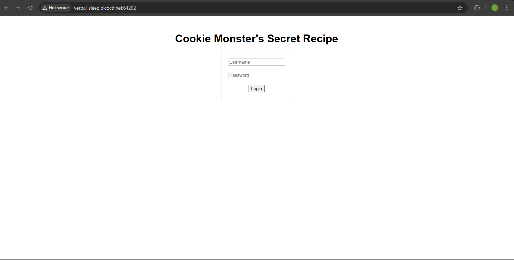
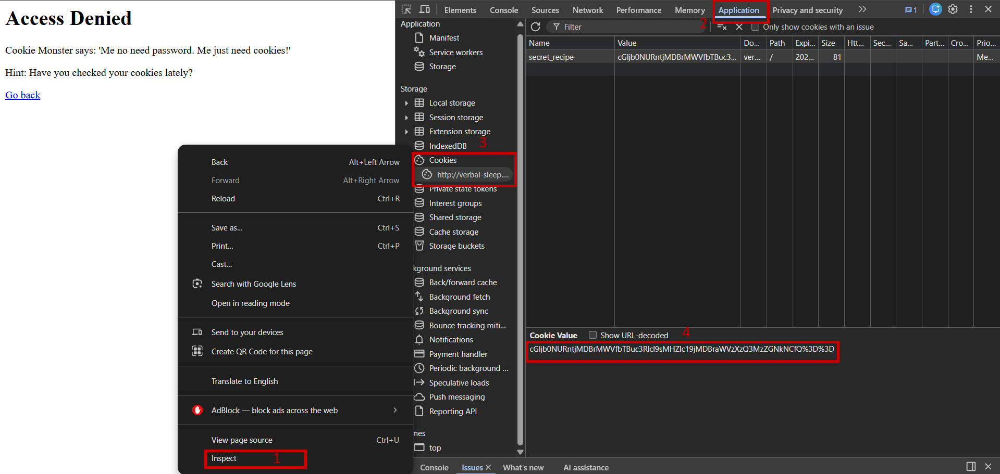
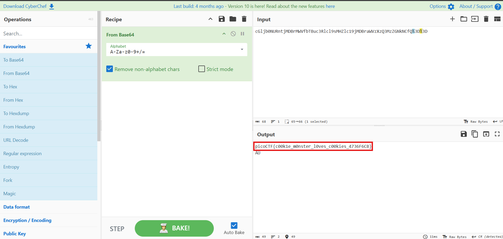

# Cookie Monster Secret Recipe - picoCTF 2025

------

## Introduction 
Cookie Monster Secret Recipe is a Web Exploitation task. The goal is to find a top-secret "cookie recipe" (also known as a flag) which is hidden on a website.

Challenge description:

> Cookie Monster has hidden his top-secret cookie recipe somewhere on his website. As an aspiring cookie detective, your mission is to uncover this delectable secret. Can you outsmart Cookie Monster and find the hidden recipe?
You can access the Cookie Monster here and good luck.

------

# My approach to finding the flag

1. First of all, I connected to the website to see how it looks.

2. I noticed there is a login form, but based on the task's name and description, the word "cookie" led me to think something might be hiding in the website's cookies.

3. I typed random characters in the login form and hit login to see what happened. After that, I **right-clicked** on the page, clicked **Inspect**, then went to the **Application** tab. Under the **Cookies** section, I found a string encoded in Base64.

4. I then went to the **CyberChef** and used it to decode the Base64 string, which revealed the flag: picoCTF{c00k1e_m0nster_l0ves_c00kies_4736F6CB}

