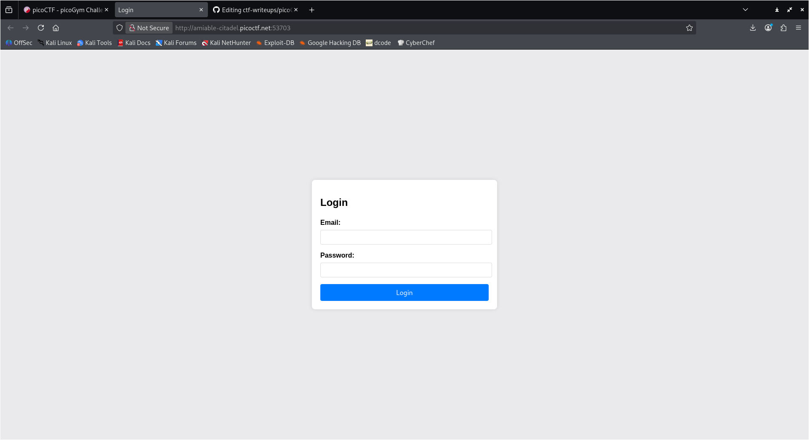
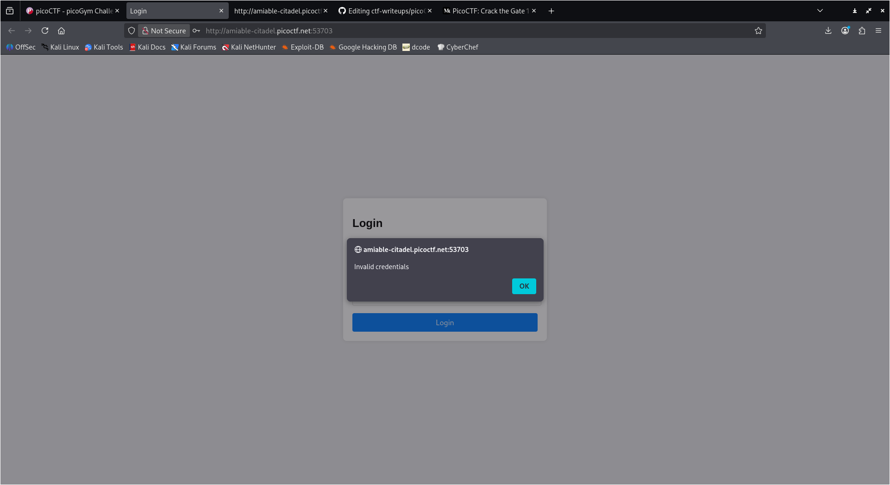
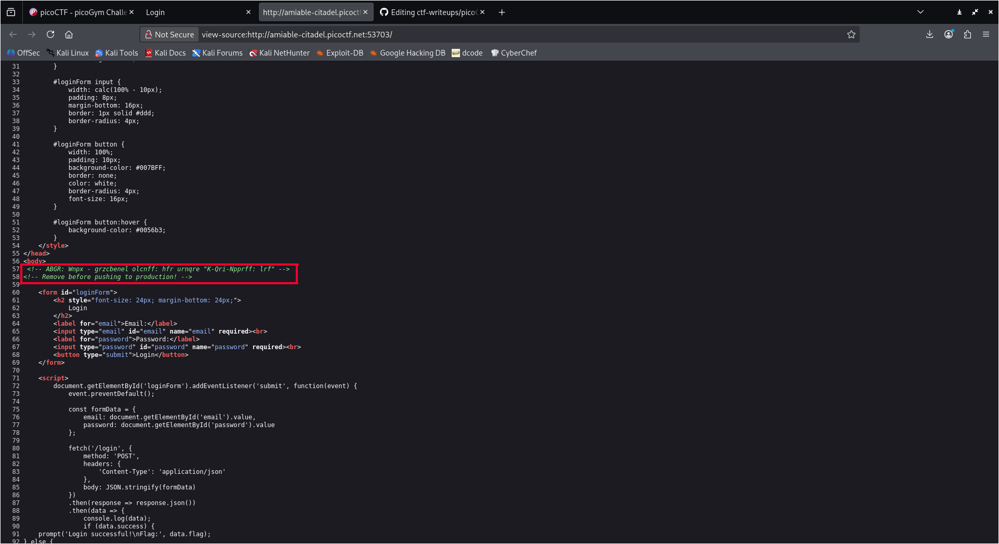
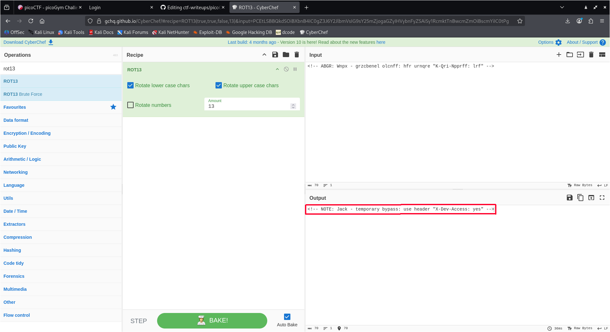
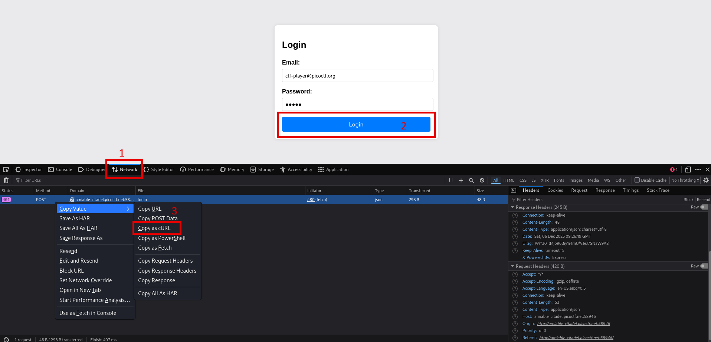
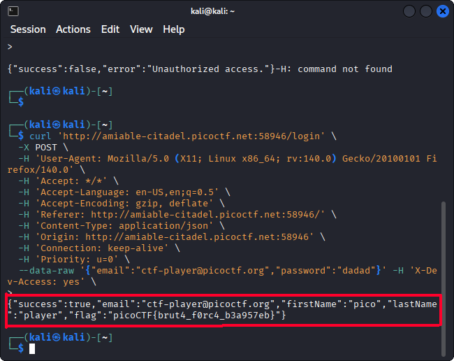

# Crack The Gate 1 - picoMini by CMU-Africa

------

## Introduction
Crack The Gate 1 is a Web Exploitation task. The goal is to analyze the login portal for vulnerabilities and find a way to bypass the authentication mechanism as `ctf-player@picoctf.org` to retrieve the sensitive data hidden inside.

Challenge description:

> We’re in the middle of an investigation. One of our persons of interest, ctf player, is believed to be hiding sensitive data inside a restricted web portal. We’ve uncovered the email address he uses to log in: ctf-player@picoctf.org. Unfortunately, we don’t know the password, and the usual guessing techniques haven’t worked. But something feels off... it’s almost like the developer left a secret way in. Can you figure it out? The website is running here. Can you try to log in?

------

## My approach to finding the flag

1. Firstly, I connected to the website to see what I am dealing with.



2. I typed random characters in the password field and hit login. The page replied with "Invalid credentials". So, I thought maybe there was something to find in the page's HTML source code. After scrolling for a little bit and inspecting the HTML, I noticed a weird comment with scrambled letters. It looked like some kind of simple obfuscation, so I tried `ROT13`. I decoded the scrambled text and found this note: `NOTE: Jack - temporary bypass: use header "X-Dev-Access: yes`.





3. Next thing I thought to try was to reproduce the bypass. Since browsers can sometimes make it difficult to modify headers directly, I decided to use `curl` in the Linux terminal. First, I had to get the correct request format:
    * Right-click on the page
    * Click **Inspect**
    * Click on the **Network** tab
    * Click the login button to capture the `POST` request
    * Right-click on the request and select **Copy as cURL**



4. After getting the cURL command, I pasted it into the terminal and manually added the required header: `-H 'X-Dev-Access: yes'`. The response printed out a JSON blob containing the flag: picoCTF{brut4_f0rc4_b3a957eb}

```bash
curl 'http://amiable-citadel.picoctf.net:58946/login' \
  -X POST \
  -H 'User-Agent: Mozilla/5.0 (X11; Linux x86_64; rv:140.0) Gecko/20100101 Firefox/140.0' \
  -H 'Accept: */*' \
  -H 'Accept-Language: en-US,en;q=0.5' \
  -H 'Accept-Encoding: gzip, deflate' \
  -H 'Referer: http://amiable-citadel.picoctf.net:58946/' \
  -H 'Content-Type: application/json' \
  -H 'Origin: http://amiable-citadel.picoctf.net:58946' \
  -H 'Connection: keep-alive' \
  -H 'Priority: u=0' \
  --data-raw '{"email":"ctf-player@picoctf.org","password":"dadad"}' -H 'X-Dev-Access: yes' \
```

