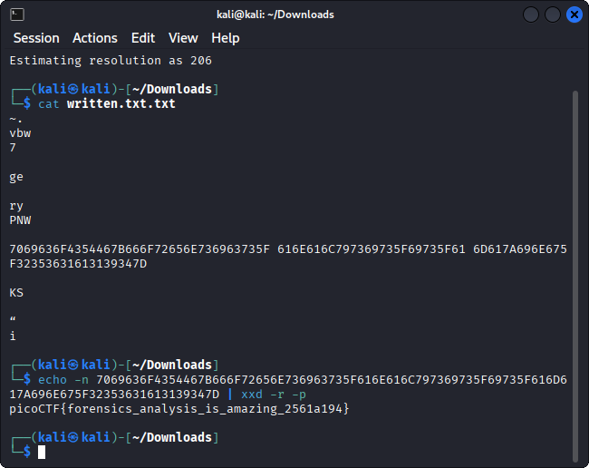

# Flag In Flame - picoMini by CMU-Africa

-----

## Introduction
Flag In Flame is a Forensics task. The goal is to decode an enormous block of text to find the flag hidden inside the file provided by the author.

Challenge description:

> The SOC team discovered a suspiciously large log file after a recent breach. When they opened it, they found an enormous block of encoded text instead of typical logs. Could there be something hidden within? Your mission is to inspect the resulting file and reveal the real purpose of it. The team is relying on your skills to uncover any concealed information within this unusual log. Download the encoded data here: Logs Data. Be prepared—the file is large, and examining it thoroughly is crucial.

-----

## My approach to finding the flag

1. First step was to open `logs.txt`. I used the command `cat` to see what is hiding inside the file.

```bash
cat logs.txt
```

2. The contents of the file were huge, so I had to change my approach. After reading the description again I have come find a clue "`enormous block of encoded text`", so I figured that I had to decode the contents of the file. After a few searches online I found a command that would help me `base64 -d` so I went ahead and used it and again used `cat` to see it's contents.

```bash
base64 -d logs.txt > decoded.txt
```

3. After examining the weird characters that were inside the decoded file I figured that it was supposed to be a `.png` file so I decoded the file again using the `base64 -d` command and opened the photo.

```bash
base64 -d logs.txt > decoded.png
```

4. Upon opening the photo I came across a huge number written on it. After a few minutes of reading online forums I came across a cool tool `tesseract-ocr`. I installed and used tesseract-ocr to extract the text from the image and write it in a new file.

```bash
tesseract decoded.png written.txt
```

5. In the end I used another cool command to decode the text from hexazecimal and this led me to find the flag: picoCTF{forensics_analysis_is_amazing_2561a194}

```bash
echo -n <text you want to decode> | xxd -r -p
```

