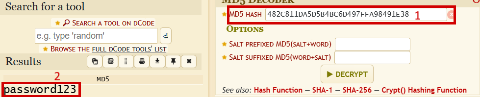
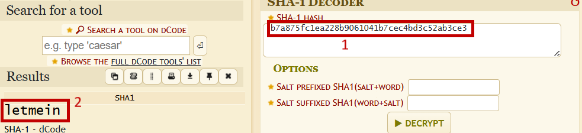
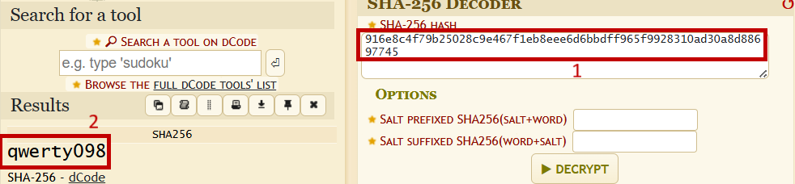
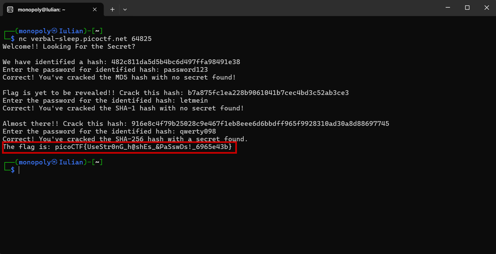

# Hashcrack - picoCTF 2025

------

## Introduction
Hashcrack is a Cryptography task. The goal is to decode the weakly hashed secrets stored on the server.

Challenge description:

> A company stored a secret message on a server which got breached due to the admin using weakly hashed passwords. Can you gain access to the secret stored within the server?
Access the server using nc verbal-sleep.picoctf.net 64825

------

## My approach to finding the flag

1. First, I connected to the server using the `nc` command in the terminal.

```bash
nc verbal-sleep.picoctf.net 64825
```

2. After running the command, the following text appeared in the terminal: `Welcome!! Looking For the Secret? We have identified a hash: 482c811da5d5b4bc6d497ffa98491e38 Enter the password for identified hash:`. I used **dCode Cipher Identifier** online tool to identify and decode the hash to get the password.



3. After submiting the decoded password, the server confirmed it and another text appeared in the terminal: `Correct! You've cracked the MD5 hash with no secret found! Flag is yet to be revealed!! Crack this hash: b7a875fc1ea228b9061041b7cec4bd3c52ab3ce3 Enter the password for the identified hash:`. I once again used **dCode** to decode this hash.
   


4. The server confirmed the second password and another text appeared in the terminal: `Correct! You've cracked the SHA-1 hash with no secret found! Almost there!! Crack this hash: 916e8c4f79b25028c9e467f1eb8eee6d6bbdff965f9928310ad30a8d88697745 Enter the password for the identified hash:`. I repeated the process one last time to find the plaintext password.
   


5. After decoding the last hash and entering the correct password, the server revealed the flag: `Correct! You've cracked the SHA-256 hash with a secret found. The flag is: picoCTF{UseStr0nG_h@shEs_&PaSswDs!_6965e43b}`.

 
