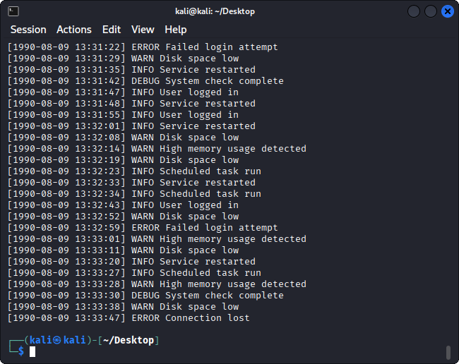
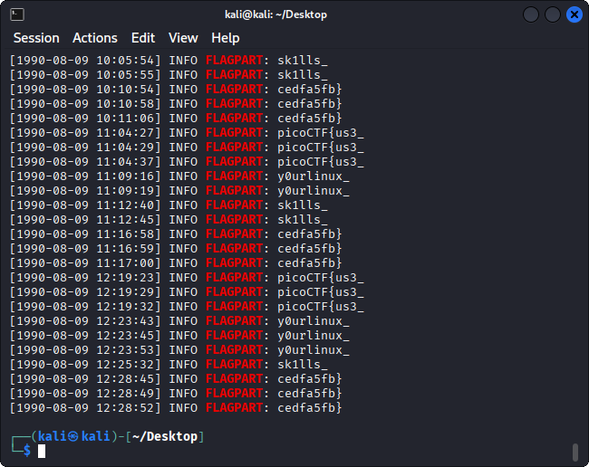

# Log Hunt - picoMini by CMU-Africa 

-----

## Introduction
Log Hunt is a General Skills task. The Goal is to find the flag pieces hidden inside the file provided by the author.

Challenge description:

> Our server seems to be leaking pieces of a secret flag in its logs. The parts are scattered and sometimes repeated. Can you reconstruct the original flag? Download the logs and figure out the full flag from the fragments.

------

## My approach to finding the flag

1. First step was to open `server.log`. I used the command `cat` to see what was inside the file.

```bash
cat server.log
```


2. The file seemed to have lots of text so I decided to go further and use the `grep` command to try and find a clue regarding the flag fragments. I started by searching for the "picoCTF" keyword.

```bash
grep "picoCTF" server.log
```


3. I figured that the word `FLAGPART` was tied to the fragments so I decided to once again use `grep "FLAGPART"`.

```bash
grep "FLAGPART" server.log
```


4. In the end I put the fragments together and found the flag: picoCTF{us3_y0urlinux_sk1lls_cedfa5fb}
