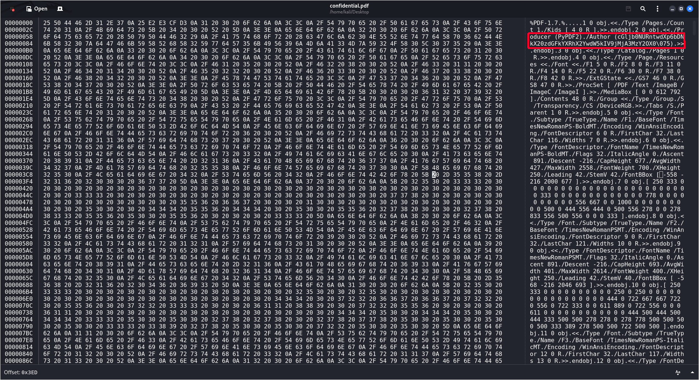

# Riddle Registry - picoMini by CMU-Africa

------

## Introduction
Riddle Registry is a Forensics task. The goal is to find the flag hidden inside a file's metadata.

Challenge's description:

> Hi, intrepid investigator! 📄🔍 You've stumbled upon a peculiar PDF filled with what seems like nothing more than garbled nonsense. But beware! Not everything is as it appears. Amidst the chaos lies a hidden treasure—an elusive flag waiting to be uncovered. Find the PDF file here Hidden Confidential Document and uncover the flag within the metadata.

------

## My approach to finding the flag

1. Based on the clue in the description, `uncover the flag within the metadata`, the first thing I did was to inspect the file's raw content using `ghex`. I opened the file and noticed something weird hidden right at the beginning of the file's header.

2. The string looked like it was encoded in Base64, so I used CyberChef to decode it. The decoding process successfully revealed the flag: picoCTF{puzzl3d_m3tadata_f0und!_c2073669}
