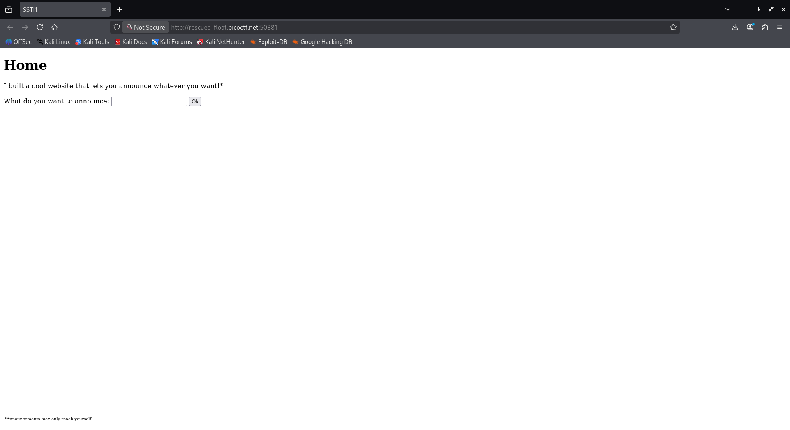
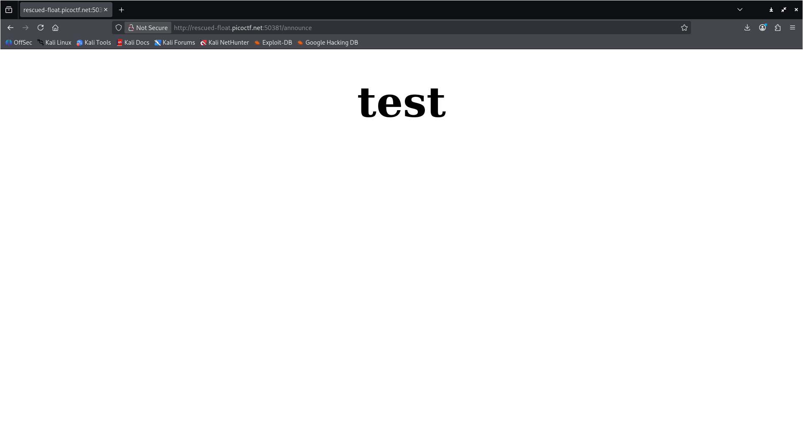
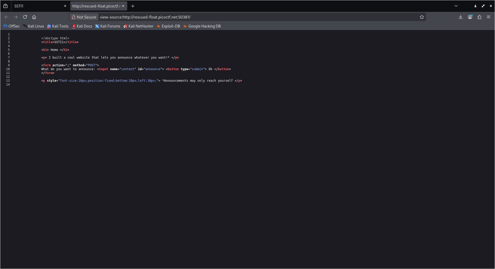
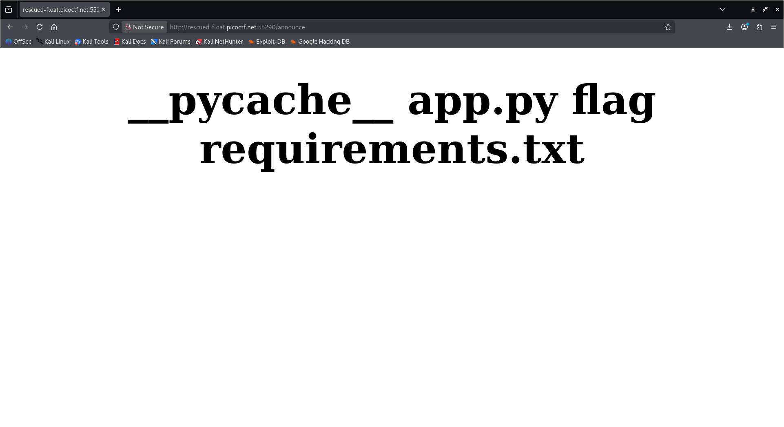
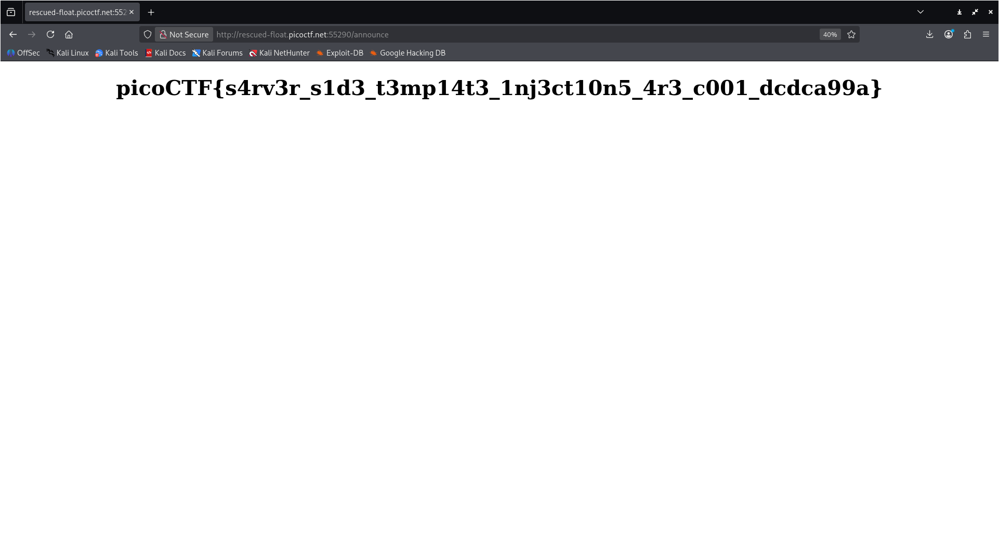

# SSTI1 - picoCTF 2025

-----

## Introduction
SSTI1 is a Web Exploitation task. The goal is to inspect the website, find the vulnerability and exploit it to find the flag.

Challenge description:

> I made a cool website where you can announce whatever you want! Try it out! I heard templating is a cool and modular way to build web apps! Check out my website here!

-----

## My approach to finding the flag

1. First thing I did was to connect to the website and see how it works.



2. After playing a little to see what the website does, I tried to look for any comments in the page's HTML source code, but there was nothing hiding there.


3. After some reading online on the topic of `server-side template injection`, I came across an article that explained really well how `ssti` works. In essence, server-side template injection is when an attacker is able to use native template syntax to inject a malicious payload into a template, which then is executed server-side. SSTI attacks can occur when user input is concatenated directly into a template, rather than passed in as data.

4. I wanted to confirm the existence of a vulnerability. So, I used a simple arithmetic operation `{{7 * 7}}` to see if the server would be executing the code between the `{{ }}` brackets or just display it as text. The answer to my prompt was `49`, this proved that the server evaluated the math expression `7 * 7`, it also confirms that the server has a SSTI vulnerability. After analyzing a decision tree I have found on the internet, I figured that the template engine was `Jinja2`.


5. Now that I had identified the template engine as `Jinja2` (commonly used by Flask), I searched for a specific payload to exploit this vulnerability and list the files in the current directory.
For the purpose of exploiting the website, I used a well known payload to escape the template sandbox and achieve Remote Code Execution (RCE). The following payload navigates through the server's Python objects `('config.__class__...)` to access the `os` module and then runs the `ls` command.

```bash
{{config.__class__.__init__.__globals__['os'].popen('ls').read()}}
```

After seeing all the files listed, I noticed a file called `flag`. So, I used a similar payload, this time modified to read the contents of that specific file using `cat flag`, which then gave me the flag: picoCTF{s4rv3r_s1d3_t3mp14t3_1nj3ct10n5_4r3_c001_dcdca99a}

```bash
{{config.__class__.__init__.__globals__['os'].popen('cat flag').read()}}
```


